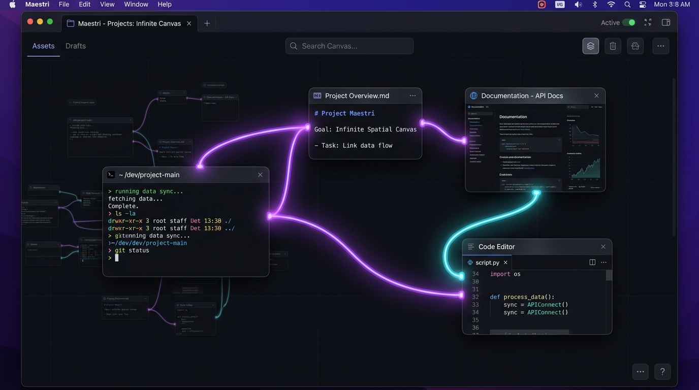
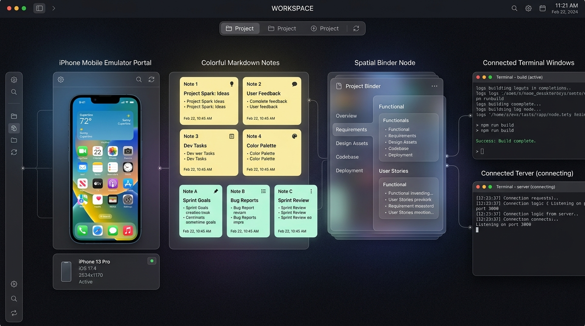

# TerminalManager

> **TerminalManager** é um aplicativo desktop espacial (Electron) para orquestração de desenvolvimento de software e agentes de IA. Ele reúne terminais PTY reais, notas Markdown vivas, árvores de arquivos Git, editores de código, portais web e simuladores móveis em um **canvas 2D espacial infinito** com zoom, pan e conexões inteligentes entre nós.



---

## 📸 Demonstração Visual

| Canvas Espacial & Conexões | Portais Móveis, Fichários & Notas Coloridas |
|---|---|
|  |  |
| *Terminais PTY, notas, portais web e cabos com pulsos luminosos de atividade.* | *Simulador iOS/Android, Fichário com abas e notas Markdown em cartões pastel.* |

---

## ⚡ Principais Recursos por Domínio

### 1. 🖥️ Canvas Espacial 2D Infinito
- **Navegação Fluida**: Pan infinito arrastando o canvas vazio e zoom contínuo com scroll ou atalhos (`⌘/Ctrl +`, `⌘/Ctrl -`, `⌘/Ctrl 0`).
- **Animações e Enquadramento**: Câmera inteligente com enquadramento de todos os nós (`V`), centralização no ponto de origem (`C`) e animação de foco suave ao clicar no nó.
- **Elevação e Encaixe Magnético**: Eleve qualquer nó sobre o canvas (`Duplo Clique`) e encaixe-o nas barras laterais (Docking). Snap magnético ao arrastrar com `Ctrl`.
- **Agrupamento Espacial**: Seleção múltipla e agrupamento visual com atalho `Ctrl+G` e molduras expansíveis.

### 2. ⚡ Terminais & Agentes de IA
- **Terminais PTY Reais**: Suporte nativo a múltiplos terminais shell (`zsh`, `bash`, `cmd.exe`, `PowerShell`).
- **Padrão Sidecar (`.terminalmanager/role.json`)**: Descoberta automática de papéis e responsabilidades para agentes de IA (Claude Code, Codex, OpenCode).
- **Indicadores de Atenção**: Ponto luminoso discreto quando um terminal em segundo plano conclui sua execução. Atalho `Ctrl+Shift+A` para ciclar rapidamente pelos terminais que requerem atenção.
- **Motor de Temas Ghostty & iTerm2**: Importação e seleção de temas visuais personalizados diretamente pelo painel de configurações (Escuro, Claro, Verde, Azul, Âmbar e temas de comunidade `~/.terminalmanager/terminal/themes/`).

### 3. 📝 Notas Markdown Vivas & Cores
- **Editor Duplo (Raw / Formatado)**: Alternância entre código raw em Markdown e visualização formatada em tempo real (`Md`).
- **Seletor de Cores de Cartão**: Paleta com 7 temas visuais (Vidro Padrão, Amarelo Post-it, Verde Menta, Azul Céu, Roxo Lavanda, Rosa Pastel e Laranja Suave).
- **Mídia Inline (`⌘V` & Drag & Drop)**: Colagem de imagens da área de transferência e drag-and-drop direto de arquivos `.md` do sistema.
- **Títulos Derivados**: O título da nota é extraído automaticamente do primeiro cabeçalho `#` ou linha de texto.

### 4. 📑 Fichário Espacial (Binder)
- **Organização Condensada**: Reúne múltiplas notas em um único nó compacto no canvas com abas laterais navegáveis.
- **Drag-in & Drag-out**: Arraste notas soltas para dentro do Fichário para agrupá-las; desatrague abas arrastando-as para fora para retransformá-las em notas soltas.

### 5. 🔗 Conexões Universais & Física de Linhas
- **Física de Corda Gravitacional (Rope)**: Curva catenária Bézier em arcos naturais ajustados pela distância, com curva em $S$ suave para conexões verticais.
- **Trilhos de Circuito (Circuit)**: Segmentos ortogonais em 90° com cantos suavemente arredondados e linhas tracejadas com fluxo animado de dados.
- **Abraçadeiras de Cabos (Cable Ties)**: Agrupamento de cabos paralelos usando `Alt + Arrastar` para criar pontos de convergência.
- **Mensageria Inter-Agentes (`terminalmanager send`)**: Envio automático de mensagens e contexto entre nós conectados via linha de comando ou automação.

### 6. 📁 Árvore de Arquivos & Editor CodeMirror
- **4 Visualizações de Arquivos**: Lista em Árvore, Grade de Ícones com Quick Look, Visualizador de Diffs e Grafo de Commits Git.
- **Editor de Código Integrado**: Sintaxe destacada para múltiplas linguagens com suporte a salvar alterações e despachar snippets diretamente para o terminal do agente.

### 7. 🌐 Portais Web & Simuladores de Dispositivos Móveis
- **Portais Web integrados**: Sessões de navegação embutidas com compartilhamento transparente de cookies e suporte a automação CLI (`terminalmanager portal eval`, `click`, `navigate`).
- **Simulador Mobile (Pixel 9 & iPhone 17 Pro Max)**: Visualização de layouts responsivos, execução de ações de botões físicos e inspetor da árvore de acessibilidade (`terminalmanager device tree`).

### 8. 🏢 Andares (Floors) & Clonagem Copy-on-Write (APFS)
- **Níveis Espaciais 3D**: Crie múltiplos andares independentes no mesmo workspace.
- **Clonagem APFS instantânea**: No macOS, a criação de andares utiliza a tecnologia Copy-on-Write do APFS em `.terminalmanager/floors/`, clonando repositórios gigabytes em milissegundos sem duplicar espaço em disco.
- **Hooks de Ciclo de Vida**: Scripts de `Setup`, `Run` e `Teardown` configuráveis por andar, com variáveis de ambiente injetadas (`$TERMINALMANAGER_FLOOR_NAME`, `$TERMINALMANAGER_FLOOR_BRANCH`).

### 9. ✍️ Compositor de Prompts Rico (`Ctrl+Shift+P`)
- **Modal de Composição**: Interface focada para redigir prompts complexos para os agentes.
- **Pílulas de Menção `@`**: Autocompletar interativo de notas (`@Nota`), arquivos (`@Arquivo`) e terminais (`@Terminal`), injetando automaticamente o contexto relevante no prompt.
- **Rascunhos Persistentes**: O rascunho de prompt é salvo por terminal e sincronizado caso o app seja fechado.

### 10. 🔍 Batuta Search (`Ctrl+P`)
- **Motor Fuzzy Diacritics-Insensitive**: Localização instantânea de qualquer nó, nota, terminal, arquivo ou comando sem se preocupar com acentuação.
- **Navegação Espacial por Câmera**: Selecionar um resultado da busca anima a câmera até o nó no canvas e foca o controle.

### 11. 🧭 Workspaces & Spotlight Nativo
- **Workspaces Mutidiretores**: Organização de projetos por pasta de trabalho, ícone e instrução (`CLAUDE.md` e `AGENTS.md` sincronizados automaticamente).
- **Indexação Spotlight macOS (`⌘+Espaço`)**: Busca profunda nativa do macOS para navegar direto para qualquer workspace ou nó via protocolo `terminalmanager://`.

---

## 🛠️ Requisitos

- **Node.js** v18 ou superior — [nodejs.org](https://nodejs.org).
- Nenhuma dependência externa ou compilador C++ é necessário (`node-pty` já contém os binários prontos N-API para macOS e Windows).

---

## 🚀 Instalação e Execução

```bash
# 1. Clonar o repositório
git clone https://github.com/diegonoceli/terminalManager.git
cd terminalManager

# 2. Instalar dependências
npm install

# 3. Iniciar o aplicativo
npm start
```

### Windows (Execução Rápida)
- Dê dois cliques em `start.bat` para instalar dependências e iniciar o app automaticamente.

---

## ⌨️ Tabela de Atalhos de Teclado

| Atalho | Descrição |
| --- | --- |
| `Ctrl+Shift+P` / `⌘ShiftP` | Abrir Compositor de Prompts Rico com autocompletar `@` |
| `Ctrl+P` / `⌘P` | Abrir Batuta Search (busca fuzzy e salto espacial) |
| `Ctrl+Shift+A` / `⌘ShiftA` | Ciclar pelos terminais com atividade/atenção pendente |
| `Ctrl+G` / `⌘G` | Agrupar nós selecionados em uma moldura espacial |
| `V` | Ver tudo (fit canvas) |
| `C` | Centralizar visão na origem (0,0) |
| `Cmd/Ctrl +` / `Cmd/Ctrl −` | Zoom In / Zoom Out |
| `Cmd/Ctrl 0` | Resetar zoom para 100% (1:1) |
| `Duplo Clique` no título | Elevar nó sobre o canvas (modo apresentação) |
| `Ctrl + Arrastar` | Ativar alinhamento magnético (snap to grid) |

---

## 📦 Gerar Pacote Instalável ou Portátil

```bash
npm run dist
```

| Plataforma | Saída Gerada |
| --- | --- |
| **Windows** | `dist/terminal-manager-1.0.0-portable.exe` (executável portátil, roda direto sem instalar) e `dist/terminal-manager-1.0.0-setup.exe` |
| **macOS** | `dist/mac-arm64/terminal-manager.app` e `dist/terminal-manager-1.0.0-arm64.dmg` |

---

## 📐 Arquitetura do Sistema

```text
electron/main.js                 Processo principal (janelas, IPC, protocolo deep link terminalmanager://)
electron/terminal-manager.js     Gerenciador de PTYs, layouts, workspaces e persitência de estado
electron/agent-cli.js            Executor de comandos CLI de agentes (terminalmanager send, note, portal, device)
electron/device-manager.js       Gerenciador de dispositivos móveis Android (adb) e iOS (xcrun simctl)
electron/roles.js                Descobridor de responsabilidades de agentes e sidecars (.terminalmanager/role.json)
electron/spotlight-service.js    Indexador nativo de busca Spotlight do macOS
public/js/canvas.js              Engine do canvas 2D (pan, zoom, física de câmera e animações)
public/js/connections.js         Gerenciador de física de conexões (Rope Bézier e Circuit 90°)
public/js/notes.js               Widget de notas Markdown vivas com temas de cores
public/js/widgets/binder.js      Widget de Fichário Espacial condensador de páginas
public/js/prompt-composer.js     Modal do Compositor de Prompts Rico com pílulas de menção
```

---

## 📄 Licença

Desenvolvido por **TerminalManager**. Licença MIT.
