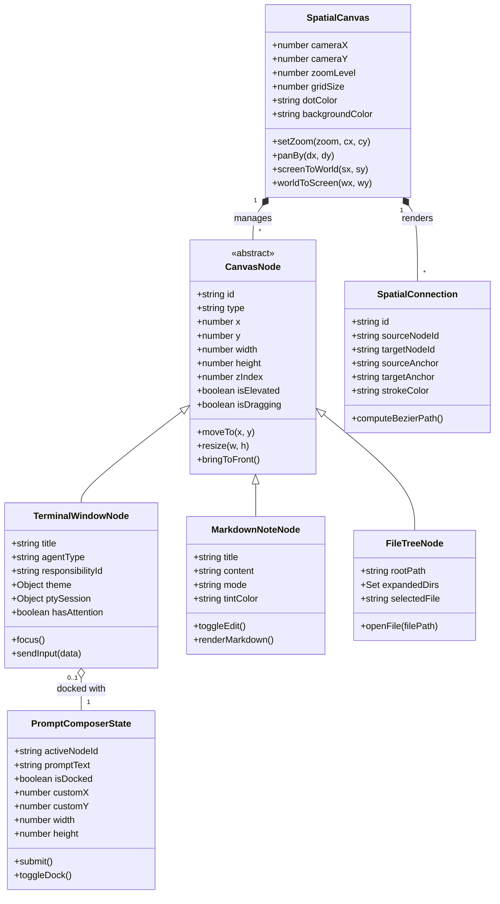

# Data Model: Maestri Spatial 2D Canvas & Liquid Glass UI

**Feature**: `008-spatial-canvas-ui`  
**Date**: 2026-09-08  
**Status**: Complete

---

## 1. Spatial Entities Overview



---

## 2. Entity Specifications

### `SpatialCanvas`
Represents the infinite 2D viewport and camera transformations.
- `cameraX` (*number*): Current horizontal translation offset in pixels.
- `cameraY` (*number*): Current vertical translation offset in pixels.
- `zoomLevel` (*number*): Scale factor, clamped between `0.1` and `3.0` (default `1.0`).
- `gridSize` (*number*): Base dot grid cell size in world units (default `24px`).
- `dotColor` (*string*): CSS rgba value for the dot pattern (`rgba(255, 255, 255, 0.12)`).
- `backgroundColor` (*string*): Dark mode canvas background (`#090b10`).

### `CanvasNode` (Base)
Common model inherited by all draggable workspace widgets.
- `id` (*string*): Unique UUID or timestamped identifier.
- `type` (*string*): `"terminal" | "note" | "filetree" | "portal" | "text" | "draw"`.
- `x`, `y` (*number*): World space Cartesian coordinates.
- `width`, `height` (*number*): Dimensions in world units.
- `zIndex` (*number*): Layer stacking order.
- `isElevated` (*boolean*): Whether node is temporarily centered/maximized above the canvas.
- `isDragging` (*boolean*): Active drag state flag for tactile opacity/scale styling.

### `TerminalWindowNode` (Specialization)
Represents a macOS floating terminal window.
- `title` (*string*): Display name of terminal or agent.
- `agentType` (*string, optional*): `"claude" | "codex" | "opencode" | "shell"`.
- `responsibilityId` (*string, optional*): ID of assigned agent persona.
- `theme` (*object*): Color configuration (`bg`, `fg`, `cursor`, `selection`).
- `hasAttention` (*boolean*): Indicates agent waiting for user confirmation.

### `PromptComposerState`
Controls the Rich Prompt Composer overlay.
- `activeNodeId` (*string*): ID of currently targeted terminal.
- `promptText` (*string*): Text content drafted in the composer.
- `isDocked` (*boolean*): `true` if attached directly beneath the active terminal; `false` if floating freely.
- `customX`, `customY` (*number*): World coordinates when undocked.
- `width`, `height` (*number*): Dynamic dimensions based on input length and terminal width.

### `SpatialConnection`
Represents physical SVG Bezier cables between nodes.
- `id` (*string*): Unique cable identifier.
- `sourceNodeId` (*string*): Origin node ID.
- `targetNodeId` (*string*): Destination node ID.
- `sourceAnchor` (*string*): Anchor position (`"right" | "bottom" | "left" | "top"`).
- `targetAnchor` (*string*): Anchor position (`"left" | "top" | "right" | "bottom"`).
- `bezierPath` (*string*): Computed SVG `d` attribute `M x1 y1 C cx1 cy1, cx2 cy2, x2 y2`.

---

## 3. Persistence & Serialization Schema

```json
{
  "$schema": "http://json-schema.org/draft-07/schema#",
  "title": "MaestriWorkspaceState",
  "type": "object",
  "required": ["camera", "nodes", "connections"],
  "properties": {
    "camera": {
      "type": "object",
      "required": ["x", "y", "zoom"],
      "properties": {
        "x": { "type": "number" },
        "y": { "type": "number" },
        "zoom": { "type": "number" }
      }
    },
    "nodes": {
      "type": "array",
      "items": {
        "type": "object",
        "required": ["id", "type", "x", "y", "width", "height"],
        "properties": {
          "id": { "type": "string" },
          "type": { "type": "string" },
          "x": { "type": "number" },
          "y": { "type": "number" },
          "width": { "type": "number" },
          "height": { "type": "number" },
          "zIndex": { "type": "number" }
        }
      }
    },
    "connections": {
      "type": "array",
      "items": {
        "type": "object",
        "required": ["id", "sourceNodeId", "targetNodeId"],
        "properties": {
          "id": { "type": "string" },
          "sourceNodeId": { "type": "string" },
          "targetNodeId": { "type": "string" }
        }
      }
    },
    "composer": {
      "type": "object",
      "properties": {
        "isDocked": { "type": "boolean" },
        "x": { "type": "number" },
        "y": { "type": "number" }
      }
    }
  }
}
```
