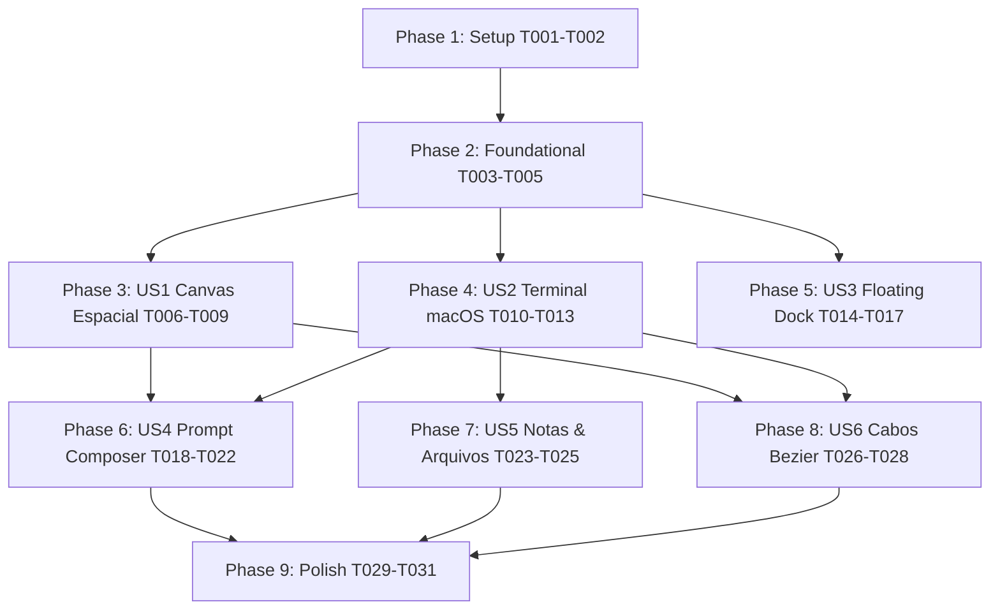

# Tasks: Maestri Spatial 2D Canvas & Liquid Glass UI

**Input**: Design documents from `specs/008-spatial-canvas-ui/` (`spec.md`, `plan.md`, `research.md`, `data-model.md`, `contracts/ui-spatial-canvas.md`, `quickstart.md`)

**Prerequisites**: `plan.md`, `spec.md`, `research.md`, `data-model.md`, `contracts/`

**Organization**: Tasks are grouped by user story to enable independent implementation and testing of each story.

## Format: `[ID] [P?] [Story] Description`

- **[P]**: Can run in parallel (different files, no dependencies)
- **[Story]**: Which user story this task belongs to (e.g., US1, US2, US3)
- Exact file paths are included in every task

---

## Phase 1: Setup (Shared Infrastructure)

**Purpose**: Establish core design system tokens and visual assets for the Liquid Glass spatial experience.

- [X] T001 Configure Liquid Glass design tokens, dark mode palette, and macOS elevation shadows in `public/styles.css`
- [X] T002 [P] Add macOS traffic-light and window control icon helpers to Lucide icon catalog in `public/js/icons.js`

---

## Phase 2: Foundational (Blocking Prerequisites)

**Purpose**: Core layout and canvas upgrades that MUST be complete before user stories are integrated.

**⚠️ CRITICAL**: The full-screen viewport and glass surface foundations enable all floating nodes and controls.

- [X] T003 Expand `#viewport` to full-screen (`inset: 0`) and eliminate fixed static top header dependencies in `public/index.html` and `public/styles.css`
- [X] T004 Implement dynamic SVG/CSS radial dot grid background synchronized with camera transform in `public/js/canvas.js` and `public/styles.css`
- [X] T005 Create foundational base styles for `.widget` with glassmorphism (`backdrop-filter: blur(24px)`), translucent border and depth drop shadows in `public/styles.css`

**Checkpoint**: Foundation ready — full-screen spatial canvas and Liquid Glass tokens are active.

---

## Phase 3: User Story 1 - Navegação Espacial no Canvas Infinito com Malha Pontilhada (Priority: P1) 🎯 MVP

**Goal**: Deliver the infinite 2D canvas with pan, zoom-to-cursor, dynamic z-index layering, and synchronized subtle dot grid.

**Independent Test**: Pan across the canvas by dragging the background, zoom in and out with the mousewheel/trackpad, and click any node to elevate its z-index over others.

### Implementation for User Story 1

- [X] T006 [P] [US1] Implement smooth pointer drag panning and inertia bounds in `public/js/canvas.js`
- [X] T007 [P] [US1] Implement continuous zoom-to-cursor scrollwheel and trackpad pinch handling in `public/js/canvas.js`
- [X] T008 [US1] Implement global dynamic `z-index` elevation and active focus manager in `public/js/main.js`
- [X] T009 [US1] Add responsive dot grid scaling and subpixel position alignment on camera update in `public/js/canvas.js`

**Checkpoint**: User Story 1 complete — navigation and spatial motor functioning at 60 FPS.

---

## Phase 4: User Story 2 - Janelas de Terminal Flutuantes com Estética Liquid Glass macOS (Priority: P1)

**Goal**: Transform terminal windows into floating macOS-style glass windows with traffic lights, integrated padding, and tactile dragging feedback.

**Independent Test**: Spawn or move a terminal window, observe backdrop blur over the dot grid, verify macOS traffic lights in the titlebar, and inspect padding integration.

### Implementation for User Story 2

- [X] T010 [P] [US2] Implement macOS traffic lights (close, minimize, maximize/elevate) titlebar header in `public/js/terminal.js`
- [X] T011 [P] [US2] Implement integrated padding and borderless TUI background blending in `public/styles.css`
- [X] T012 [US2] Implement tactile drag feedback (opacity and microscale elevation) on `.widget.dragging` in `public/styles.css` and `public/js/terminal.js`
- [X] T013 [US2] Wire traffic light action handlers (close, minimize to dock, maximize/elevate) to terminal window lifecycle in `public/js/terminal.js`

**Checkpoint**: User Stories 1 & 2 complete — floating macOS terminal windows fully operational in the spatial canvas.

---

## Phase 5: User Story 3 - Barra de Ferramentas Estilo Dock Flutuante Translúcido (Priority: P1)

**Goal**: Implement the floating macOS Dock toolbar centered at the bottom of the screen with quick creation tools and camera controls.

**Independent Test**: Interact with the floating glass dock pill, click action buttons to spawn nodes, and use zoom/fit buttons to manipulate the camera.

### Implementation for User Story 3

- [X] T014 [P] [US3] Create `FloatingDock` class and glass pill container in `public/js/floating-dock.js`
- [X] T015 [P] [US3] Add styles for floating glass dock toolbar, hover elevations, and status indicators in `public/styles.css`
- [X] T016 [US3] Mount `FloatingDock` into `public/index.html` and connect creation actions (Terminal, Note, Files, Cables) in `public/js/main.js`
- [X] T017 [US3] Connect camera quick controls (Zoom In, Zoom Out, Reset 1:1, Fit All, Center) to `FloatingDock` in `public/js/floating-dock.js`

**Checkpoint**: User Stories 1, 2 & 3 complete — full spatial creation and navigation workflow via floating glass Dock.

---

## Phase 6: User Story 4 - Compositor de Prompts Rico e Flutuante com Ancoragem Magnética (Priority: P2)

**Goal**: Deliver the rich multiline prompt composer that magnetically docks under the active terminal or floats freely on the canvas.

**Independent Test**: Focus a terminal, verify the prompt composer docks beneath it, write a multiline prompt, send with `Enter` to PTY, and drag the composer to test free floating.

### Implementation for User Story 4

- [X] T018 [P] [US4] Create `PromptComposer` class with elastic multiline textarea and control buttons in `public/js/prompt-composer.js`
- [X] T019 [P] [US4] Add Liquid Glass styles and transition animations for `#prompt-composer` in `public/styles.css`
- [X] T020 [US4] Implement magnetic docking engine that positions and sizes composer directly under active terminal in `public/js/prompt-composer.js`
- [X] T021 [US4] Implement undocking/drag handle to allow free floating positioning on canvas in `public/js/prompt-composer.js`
- [X] T022 [US4] Wire submission handler (`Enter` / button click) to dispatch commands into active terminal PTY via `app.sendInput()` in `public/js/main.js`

**Checkpoint**: User Story 4 complete — rich prompt input seamlessly connected to terminal PTY processes.

---

## Phase 7: User Story 5 - Nós de Notas Markdown e Árvore de Arquivos Flutuante em Vidro Líquido (Priority: P2)

**Goal**: Adapt Markdown Notes and File Tree widgets into floating canvas blocks styled with the Liquid Glass design language.

**Independent Test**: Instantiate a File Tree widget and a Markdown Note widget, move them across the canvas, edit Markdown, and explore directories.

### Implementation for User Story 5

- [X] T023 [P] [US5] Update `public/js/notes.js` to render notes with glassmorphic cards, pastel tints, and smooth edit/render toggles
- [X] T024 [P] [US5] Update `public/js/filetree.js` to render file tree as an independent floating canvas block widget
- [X] T025 [US5] Apply Liquid Glass tokens and unified border/shadow styling to notes and file tree in `public/styles.css`

**Checkpoint**: User Story 5 complete — all core content nodes (terminals, notes, files) unified under spatial canvas.

---

## Phase 8: User Story 6 - Cabos e Conexões Físicas em Curvas Bezier Dinâmicas (Priority: P3)

**Goal**: Render physical SVG Bezier cables connecting nodes with dynamic re-tracking during movement.

**Independent Test**: Connect two nodes with a wire, drag either node around, and verify the Bezier curve recalculates smoothly in real time.

### Implementation for User Story 6

- [X] T026 [P] [US6] Refactor cubic Bezier calculation (`M x1 y1 C cx1 cy1, cx2 cy2, x2 y2`) with elastic tension in `public/js/connections.js`
- [X] T027 [P] [US6] Add glowing gradient SVG filter and physical cable aesthetic styling in `public/styles.css`
- [X] T028 [US6] Synchronize real-time cable re-tracking during node drag and resize in `public/js/connections.js`

**Checkpoint**: User Story 6 complete — dynamic SVG physical cable wiring operational.

---

## Phase 9: Polish & Cross-Cutting Concerns

**Purpose**: Ensure accessibility, edge cases, and state persistence are solid.

- [X] T029 Implement `prefers-reduced-motion` fallbacks across canvas camera interpolation and widget transitions in `public/styles.css`
- [X] T030 Verify terminal scrollback gesture isolation from canvas zoom on trackpad/mouse in `public/js/terminal.js` and `public/js/canvas.js`
- [X] T031 Validate workspace state persistence (camera, node positions, sizes, z-indexes) in `public/js/main.js`

---

## Dependencies & Execution Order

### Parallel Opportunities

- **Phase 1**: `T001` (styles) and `T002` (icons) can run in parallel.
- **Phase 3 (US1)**: `T006` (pan) and `T007` (zoom) can run in parallel.
- **Phase 4 (US2)**: `T010` (traffic lights) and `T011` (padding) can run in parallel.
- **Phase 5 (US3)**: `T014` (dock class) and `T015` (dock css) can run in parallel.
- **Phase 6 (US4)**: `T018` (composer class) and `T019` (composer css) can run in parallel.
- **Phase 7 (US5)**: `T023` (notes) and `T024` (filetree) can run in parallel.
- **Phase 8 (US6)**: `T026` (bezier math) and `T027` (svg filter styles) can run in parallel.

### Implementation Strategy

1. **MVP Scope (Phases 1, 2, 3 & 4)**:
   - Full-screen infinite canvas with subtle dot grid.
   - Smooth pan & zoom.
   - Floating macOS-style Terminal window prototype with Liquid Glass aesthetic.
2. **Expansion (Phases 5 & 6)**:
   - Floating macOS Dock toolbar.
   - Magnetic docked Rich Prompt Composer.
3. **Full Parity (Phases 7, 8 & 9)**:
   - Floating Notes and File Tree widgets.
   - Dynamic SVG Bezier cables.
   - Reduced motion accessibility and persistence validation.
