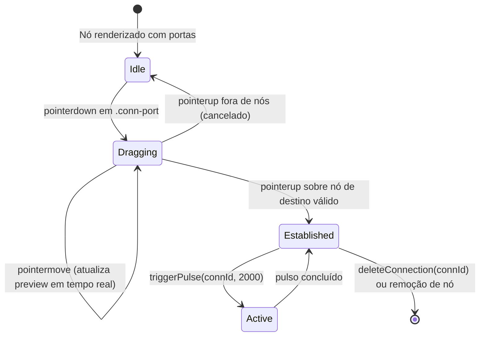

# Data Model: Conexões Espaciais e Traçado de Cabos (009-fix-connections-wire)

## Entidades e Estruturas de Dados

### 1. Connection (Cabo de Ligação)
Representa a interligação física/lógica entre dois nós espaciais no canvas.

| Campo | Tipo | Descrição |
| :--- | :--- | :--- |
| `id` | `string` | Identificador único (ex: `conn-1725800000-abc12`) |
| `from` | `string` | ID do nó de origem da conexão |
| `to` | `string` | ID do nó de destino da conexão |
| `style` | `"rope" \| "circuit"` | Estilo de traçado geométrico (Corda elástica ou Circuito 90°) |
| `color` | `string` | Cor hexadecimal ou variável CSS da linha (padrão: `#3b82f6`) |
| `active` | `boolean` | Indica se o cabo está com tráfego ou atividade em tempo real |
| `label` | `string?` | Rótulo descritivo opcional sobreposto ao feixe |

### 2. ActiveDrag (Estado Efêmero de Arraste de Fio)
Armazenado na memória do cliente durante o gesto de ligação.

| Campo | Tipo | Descrição |
| :--- | :--- | :--- |
| `fromId` | `string` | ID do nó onde o clique na porta foi iniciado |
| `currentWorld` | `{ x: number, y: number }` | Ponto cartesiano atual do cursor em coordenadas do mundo |
| `style` | `"rope" \| "circuit"` | Estilo aplicado à linha de pré-visualização |

### 3. AnchorPoint (Ponto de Ancoragem de Porta)
Coordenadas calculadas para as portas de conexão laterais de um nó.

| Campo | Tipo | Descrição |
| :--- | :--- | :--- |
| `nodeId` | `string` | ID do nó associado |
| `side` | `"left" \| "right"` | Lado da porta lateral |
| `x` | `number` | Coordenada X absoluta no espaço do mundo (`worldPos.x` ou `worldPos.x + worldSize.w`) |
| `y` | `number` | Coordenada Y absoluta centralizada (`worldPos.y + worldSize.h / 2`) |

### Transições de Estado de Conexão

