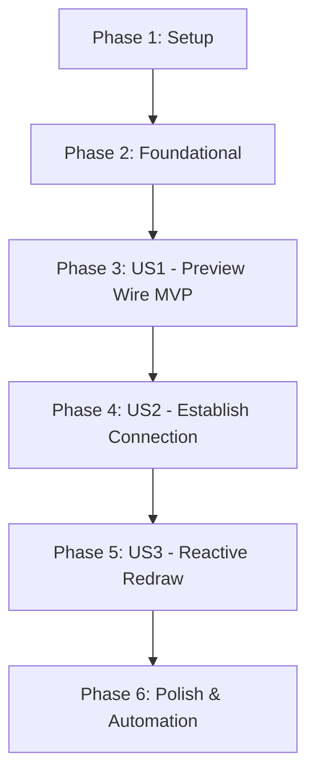

# Tasks: Restauração da Interatividade de Fios e Conexões entre Recursos Espaciais

**Input**: Design documents from `/specs/009-fix-connections-wire/`
**Prerequisites**: plan.md, spec.md, research.md, data-model.md, contracts/ui-connections.md

---

## Phase 1: Setup (Ambiente e Verificação Base)

**Purpose**: Verificação das estruturas de conexões e ambiente de desenvolvimento

- [ ] T001 Validar ambiente de execução e sintaxe base de `public/js/connections.js`

---

## Phase 2: Foundational (Pré-requisitos Bloqueantes)

**Purpose**: Métodos centrais de cálculo geométrico necessários para qualquer interação de conexão

**⚠️ CRITICAL**: Nenhuma interação de fio de conexão funciona sem a restauração dos métodos de cálculo de curva

- [ ] T002 Implementar método de compatibilidade `_calculateBezier(src, dst)` delegando para `_calculatePath` em `public/js/connections.js`
- [ ] T003 Configurar estilo padrão de pré-visualização e inicialização da camada SVG `#connections-layer` em `public/js/connections.js`

**Checkpoint**: Base de cálculo geométrico restaurada — o traçado interativo pode agora ser corrigido e testado

---

## Phase 3: User Story 1 - Arraste e Visualização do Traço de Conexão em Tempo Real (Priority: P1) 🎯 MVP

**Goal**: Permitir clicar em qualquer porta de conexão lateral de um nó e arrastar o cursor pelo canvas visualizando o fio flexível em tempo real sem erros no console.

**Independent Test**: Clicar na porta lateral de um nó no canvas e arrastar livremente o cursor; verificar que a linha de preview acompanha a ponta do mouse a 60fps sem emitir `TypeError: this._calculateBezier is not a function`.

### Implementation for User Story 1

- [ ] T004 [US1] Corrigir chamada em `_updatePreview()` para invocar `this._calculatePath(src, dst, { style: this.defaultStyle || "rope" })` em `public/js/connections.js`
- [ ] T005 [P] [US1] Ajustar tratamento de coordenadas cartesianas no `startDrag` e `_onPointerMove` considerando a escala de zoom do canvas em `public/js/connections.js`
- [ ] T006 [P] [US1] Assegurar estilização visual e visibilidade da classe `.conn-preview-line` em `public/styles.css`
- [ ] T007 [US1] Adicionar listener de teclado para cancelamento gracioso do traço ao pressionar a tecla Escape em `public/js/connections.js`

**Checkpoint**: Traçado provisório 100% funcional no arraste, eliminando o erro crítico no console e entregando o MVP.

---

## Phase 4: User Story 2 - Estabelecimento e Persistência de Ligações entre Recursos (Priority: P1)

**Goal**: Ao soltar o traço sobre um nó de destino válido, criar a conexão física definitiva entre os nós, persistir no workspace e acionar feedback luminoso.

**Independent Test**: Iniciar o traço na porta do Nó A e soltar o cursor sobre a superfície do Nó B; verificar a renderização imediata do cabo persistente e emissão de pulso luminoso azul.

### Implementation for User Story 2

- [ ] T008 [US2] Aprimorar detecção de nó destino no `_onPointerUp` com validação contra conexões cíclicas reflexivas (`fromId === toId`) em `public/js/connections.js`
- [ ] T009 [P] [US2] Verificar despacho da mensagem `create_connection` e atualização do mapa de conexões ativas em `public/js/main.js`
- [ ] T010 [P] [US2] Garantir acionamento do pulso luminoso `triggerPulse(conn.id, 2000)` ao confirmar a criação do cabo em `public/js/connections.js`
- [ ] T011 [US2] Validar disparadores de porta lateral em todos os widgets (Terminal, Web Portal, Device Portal, Editor, Nota, Árvore de Arquivos, Texto e Desenho) em `public/js/portals.js`, `public/js/terminal.js` e `public/js/widgets/textdraw.js`

**Checkpoint**: Conexões persistentes criadas com sucesso entre qualquer par de nós do canvas espacial.

---

## Phase 5: User Story 3 - Redesenho Reativo Contínuo ao Mover Recursos Conectados (Priority: P2)

**Goal**: Assegurar que os cabos acompanhem instantaneamente as portas laterais dos nós durante deslocamentos, redimensionamentos e transições de câmera a 60fps.

**Independent Test**: Conectar dois nós e arrastar um deles livremente; observar o cabo recalculando suas âncoras e curvaturas em tempo real sem descolar.

### Implementation for User Story 3

- [ ] T012 [US3] Sincronizar chamadas de `this.app.connections.redrawAll()` nos métodos `setPosition` e `setSize` de `public/js/portals.js` e `public/js/terminal.js`
- [ ] T013 [P] [US3] Otimizar cálculo de pontos de ancoragem esquerda e direita baseados na posição relativa dos nós em `public/js/connections.js`

**Checkpoint**: Cabos completamente sincronizados e reativos à manipulação espacial dos nós.

---

## Phase 6: Polish & Cross-Cutting Concerns

**Purpose**: Testes automatizados, verificação de regressão e garantia de qualidade

- [ ] T014 [P] Criar teste automatizado headless com Electron para validar o fluxo completo de arraste, criação de conexão e ausência de erros no console em `scratch/test-connections-wire.cjs`
- [ ] T015 Executar verificação de sintaxe `node -c` em todos os arquivos modificados e testar inicialização sem avisos de runtime

---

## Dependencies & Execution Order

### Parallel Execution Opportunities
- **US1**: T005 (`_onPointerMove`), T006 (`public/styles.css`) podem ser executados em paralelo com T004.
- **US2**: T009 (`public/js/main.js`) e T010 (`public/js/connections.js`) podem ser executados em paralelo com T008.
- **US3**: T013 (`public/js/connections.js`) pode rodar em paralelo com T012.
- **Polish**: T014 (`scratch/test-connections-wire.cjs`) pode ser preparado em paralelo com T013.

---

## Implementation Strategy (MVP First)

1. **MVP (Phase 3 - US1)**: Corrigir imediatamente o erro `TypeError: this._calculateBezier is not a function`, permitindo que o usuário clique na porta lateral e veja o traço elástico acompanhando o ponteiro do mouse sem falhas de script.
2. **Incremento 2 (Phase 4 - US2)**: Viabilizar a criação física persistente ao soltar sobre o nó destino, emitindo o pulso de luz azul.
3. **Incremento 3 (Phase 5 - US3)**: Garantir reatividade 60fps ao mover ou redimensionar nós.
4. **Validação Final (Phase 6)**: Script automatizado via Electron headless garantindo 100% de estabilidade.
