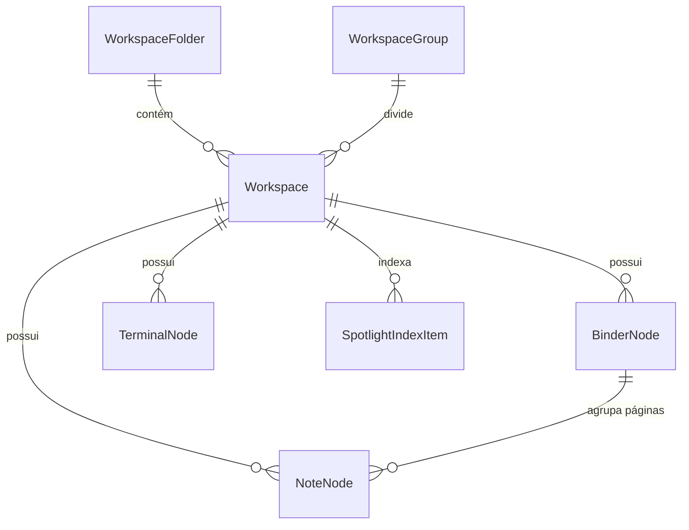

# Data Model: Mini Barra Lateral, Editor, Notas Avançadas, Fichários e Spotlight

**Feature**: `010-workspaces-nav-spotlight`
**Date**: 2026-09-08

---

## 1. Entidades Principais



---

## 2. Especificação das Estruturas de Dados

### 2.1. `WorkspaceFolder` (Pastas na Barra Lateral)
Representa um agrupador colapsável de workspaces na sidebar.
```typescript
interface WorkspaceFolder {
  id: string;             // Prefixo "folder_" + UUID curto
  name: string;           // Rótulo da pasta (ex.: "Backend Services")
  collapsed: boolean;     // Estado de expansão/recolhimento
  workspaceIds: string[]; // IDs dos workspaces membros ordenados
  createdAt: string;      // ISO 8601
}
```

### 2.2. `WorkspaceGroup` (Divisores de Seção)
Representa um divisor de categorias com rótulo na barra lateral.
```typescript
interface WorkspaceGroup {
  id: string;             // Prefixo "group_" + UUID curto
  name: string;           // Rótulo do divisor (ex.: "Trabalho", "Pessoal")
  order: number;          // Posição vertical relativa
}
```

### 2.3. `NoteNode` (Nota Markdown Espacial)
Representa o post-it markdown com suporte a assets, arquivo externo e fixação de título.
```typescript
interface NoteNode {
  id: string;             // Prefixo "node_" + UUID curto
  type: "note";
  title: string;          // Nome derivado da 1ª linha ou fixado
  pinned: boolean;        // true se o usuário fixou um nome estável
  view: "raw" | "rendered"; // Modo de visualização ativo
  filePath: string;       // Caminho do arquivo .md no disco
  internal: boolean;      // true se for arquivo interno do Maestri, false se externo do projeto
  binderId?: string | null; // ID do Fichário ao qual a nota pertence (se arquivada)
  x: number;              // Posição no mundo espacial
  y: number;
  width: number;
  height: number;
  color?: string;         // Cor do post-it (se definida)
}
```

### 2.4. `BinderNode` (Fichário de Notas com Abas)
Representa a pasta física condensada com abas laterais à direita que agrupa notas.
```typescript
interface BinderNode {
  id: string;             // Prefixo "binder_" + UUID curto
  type: "binder";
  title: string;          // Nome personalizado ("Backlog", "Fazendo", etc.) ou vazio para anônimo
  named: boolean;         // true se foi explicitamente nomeado pelo usuário
  uniformColor?: string | null; // Cor uniforme aplicada a todas as páginas
  activePageId: string;   // ID da nota atualmente exibida no primeiro plano
  pageIds: string[];      // Lista ordenada de IDs de notas filhas (topo para fundo)
  x: number;
  y: number;
  width: number;
  height: number;
}
```

### 2.5. `SpotlightIndexItem` (Metadados do macOS Spotlight)
Item indexável exportado para busca nativa do sistema operacional.
```typescript
interface SpotlightIndexItem {
  id: string;             // Identificador único no Spotlight
  type: "workspace" | "terminal" | "note" | "binder";
  title: string;          // Título principal exibido no Spotlight
  snippet: string;        // Conteúdo textual ou últimos comandos
  workspaceId: string;    // Workspace de destino
  nodeId?: string;        // ID do recurso específico no canvas
  url: string;            // maestri://open?workspace={ws}&node={nodeId}
  updatedAt: string;      // ISO 8601
}
```

---

## 3. Regras de Validação e Ciclo de Vida

1. **Permanência do Fichário**:
   - Se `binder.named === true`: o nó permanece no canvas mesmo com `pageIds.length === 0`.
   - Se `binder.named === false`: quando `pageIds.length === 0`, o nó é imediatamente excluído do estado do workspace.
2. **Exclusividade de Pertencimento**:
   - Uma nota pode pertencer a no máximo um Fichário por vez (`note.binderId`).
   - Quando arquivada em um Fichário, a nota individual não é renderizada solta no canvas global, mas sim como página do Fichário.
3. **Persistência de Arquivos Externos**:
   - Notas com `internal === false` (arrastadas do Finder ou com "Mover para...") nunca são apagadas do disco ao serem fechadas ou excluídas pelo atalho <kbd>⌘W</kbd>.
   - Apenas o registro do nó no canvas é removido.
