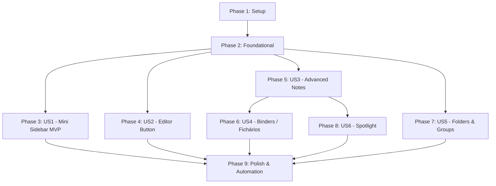

# Tasks: Mini Barra Lateral, Editor, Notas Avançadas, Fichários e Spotlight

**Input**: Design documents from `/specs/010-workspaces-nav-spotlight/`
**Prerequisites**: plan.md, spec.md, research.md, data-model.md, contracts/ui-contracts.md

---

## Phase 1: Setup (Infraestrutura Compartilhada)

**Purpose**: Verificação das estruturas base e preparação do ambiente

- [X] T001 Validar ambiente de execução e sintaxe dos arquivos base (`public/js/workspace-sidebar.js`, `public/js/notes.js`, `public/styles.css`, `electron/terminal-manager.js`)

---

## Phase 2: Foundational (Pré-requisitos Bloqueantes)

**Purpose**: Estruturas de dados no backend que suportam Fichários, Pastas e Grupos

**⚠️ CRITICAL**: A persistência de pastas, grupos e fichários no backend é necessária para todas as histórias de organização espacial

- [X] T002 Atualizar modelo do `state.json` e serialização em `electron/terminal-manager.js` para suportar `folders`, `groups` e nós do tipo `binder`
- [X] T003 [P] Registrar handlers IPC base para fichários (`binder_create`, `binder_add_page`, etc.) e pastas/grupos em `electron/main.js`

**Checkpoint**: Backend preparado para manipular novos tipos de nós e estruturas organizacionais

---

## Phase 3: User Story 1 - Mini Barra Lateral Interativa (Priority: P1) 🎯 MVP

**Goal**: Modo compacto (~48px) exibindo apenas ícones circulares, com alternância no clique, tooltip no hover prolongado (>200ms), long-press (~400ms) abrindo popover com lista de terminais para foco direto, e clique direito para menu de contexto completo.

**Independent Test**: Recolher a barra lateral para o modo mini; passar o cursor sobre um ícone e validar tooltip; segurar o clique por 400ms e verificar popover de terminais; clicar com botão direito e validar menu de contexto.

### Implementation for User Story 1

- [X] T004 [US1] Implementar modo mini da barra lateral em `public/js/workspace-sidebar.js` com layout colapsado (~48px) e tooltips nativos/flutuantes no hover
- [X] T005 [US1] Implementar detecção de long-press (~400ms) no `pointerdown`/`pointermove`/`pointerup` sem colisão com drag-and-drop em `public/js/workspace-sidebar.js`
- [X] T006 [P] [US1] Criar container e estilização do popover flutuante de terminais em `public/styles.css` e vincular foco com clique no nó em `public/js/workspace-sidebar.js`
- [X] T007 [P] [US1] Assegurar ativação do menu de contexto completo no botão direito sobre o ícone na mini barra em `public/js/workspace-sidebar.js`

**Checkpoint**: Mini barra lateral 100% funcional com navegação rápida, tooltips e popover de terminais.

---

## Phase 4: User Story 2 - Botão de Abertura Rápida no Editor de Código (Priority: P1)

**Goal**: Botão fixo no canto superior direito da toolbar que abre instantaneamente o diretório de trabalho do workspace atual no VS Code ou editor padrão.

**Independent Test**: Clicar no botão "Abrir no Editor" com diretório configurado e validar disparo do editor; clicar sem diretório e validar abertura do seletor nativo.

### Implementation for User Story 2

- [X] T008 [US2] Adicionar botão "Abrir no Editor" no cabeçalho superior direito (`#toolbar`) em `public/index.html` e estilizar em `public/styles.css`
- [X] T009 [US2] Implementar listener de clique do botão com disparo de `open_vscode` e fallback para `dir_pick` quando sem diretório em `public/js/main.js`

**Checkpoint**: Botão de editor responsivo e integrado no topo da interface.

---

## Phase 5: User Story 3 - Notas Markdown Espaciais Avançadas (Priority: P1)

**Goal**: Post-its markdown reais com alternância Raw/Formatada, colar imagens inline (<kbd>Cmd+V</kbd>), renomeação com reset automático pela 1ª linha, arrastar `.md`/`.txt` do Finder e atalho de exclusão <kbd>⌘W</kbd>.

**Independent Test**: Colar imagem via clipboard em uma nota e validar renderização; renomear por duplo-clique no cabeçalho e esvaziar para testar auto-derivação; arrastar `.md` do Finder para o canvas; teclar ⌘W para excluir.

### Implementation for User Story 3

- [X] T010 [US3] Implementar listener de `paste` para colar imagens da área de transferência com salvamento local de assets e inserção de markdown em `public/js/notes.js` e `electron/main.js`
- [X] T011 [P] [US3] Aprimorar duplo-clique no cabeçalho da nota para renomeação estável e restauração automática pela primeira linha quando o campo for limpo em `public/js/notes.js`
- [X] T012 [P] [US3] Permitir arrastar e soltar arquivos `.md`, `.markdown` e `.txt` do macOS Finder direto para o canvas criando notas externas em `public/js/canvas.js` e `public/js/main.js`
- [X] T013 [US3] Implementar atalho global <kbd>⌘W</kbd> / <kbd>Ctrl+W</kbd> para fechar e remover a nota selecionada em `public/js/main.js`

**Checkpoint**: Notas ricas com imagens, integração Finder e edição fluida.

---

## Phase 6: User Story 4 - Fichários de Notas com Abas Laterais e Workflows (Priority: P2)

**Goal**: Agrupar notas em Fichário espacial com abas verticais à direita para folhear, drag-in de notas soltas, drag-out de abas para o canvas, reordenação de abas, unificação de cor e persistência de quadros Kanban vazios com nome.

**Independent Test**: Selecionar duas notas e escolher "Colocar no Fichário"; folhear abas; puxar aba para fora do fichário soltando como nota livre; renomear Fichário e esvaziar testando persistência do container vazio.

### Implementation for User Story 4

- [X] T014 [US4] Criar classe `BinderWidget` com container de nota ativa e abas verticais na borda direita em `public/js/widgets/binder.js`
- [X] T015 [P] [US4] Implementar estilos visuais do Fichário (abas sobrepostas, cores, scroll suave de abas) em `public/styles.css`
- [X] T016 [US4] Implementar ação de contexto "Colocar no Fichário" na seleção múltipla de notas em `public/js/main.js` e `public/js/widgets/binder.js`
- [X] T017 [P] [US4] Implementar drag-in de notas sobre o Fichário e drag-out a partir das abas para recriar post-its livres no canvas em `public/js/widgets/binder.js`
- [X] T018 [US4] Implementar persistência de Fichários nomeados vazios e dissolução automática de fichários anônimos em `public/js/widgets/binder.js` e `electron/terminal-manager.js`
- [X] T019 [P] [US4] Suportar conexão de cabos a Fichários com concatenação de conteúdo para leitura por agentes em `electron/terminal-manager.js` e `public/js/connections.js`

**Checkpoint**: Fichários totalmente interativos servindo como agrupadores e colunas de fluxo de trabalho.

---

## Phase 7: User Story 5 - Organização da Barra Lateral por Pastas e Grupos (Priority: P2)

**Goal**: Organizar workspaces em pastas colapsáveis e divisores de grupos rotulados na barra lateral.

**Independent Test**: Criar grupo divisor; criar pasta e arrastar workspaces para dentro; recolher/expandir a pasta; verificar persistência no `state.json`.

### Implementation for User Story 5

- [X] T020 [US5] Implementar renderização e manipulação de `folders` (expansíveis/recolhíveis com drop de workspaces) em `public/js/workspace-sidebar.js`
- [X] T021 [P] [US5] Implementar renderização de divisores de `groups` rotulados na lista da barra lateral em `public/js/workspace-sidebar.js`
- [X] T022 [US5] Persistir hierarquia de pastas e grupos no `state.json` em `electron/terminal-manager.js`

**Checkpoint**: Barra lateral estruturada com pastas e grupos.

---

## Phase 8: User Story 6 - Integração de Busca Global via macOS Spotlight (Priority: P3)

**Goal**: Indexação de workspaces, notas e terminais no Spotlight do macOS com deep-link `maestri://open` e foco animado.

**Independent Test**: Buscar no Spotlight por nota criada; clicar no resultado e verificar abertura do app centrando o recurso no canvas.

### Implementation for User Story 6

- [X] T023 [US6] Registrar protocolo `maestri://open` e listener `open-url` no macOS em `electron/main.js`
- [X] T024 [P] [US6] Implementar gerador de metadados do Spotlight indexando notas, terminais e workspaces em `electron/main.js`
- [X] T025 [US6] Implementar foco animado com pulso visual no canvas ao receber evento `focus_node` em `public/js/main.js`

**Checkpoint**: Busca global via Spotlight integrada ao ecossistema macOS.

---

## Phase 9: Polish & Cross-Cutting Concerns

**Purpose**: Testes automatizados, verificação de regressão e garantia de qualidade

- [X] T026 [P] Criar teste automatizado headless com Electron cobrindo a mini barra lateral, atalhos de editor, Fichários e notas em `scratch/test-workspaces-nav.cjs`
- [X] T027 Executar verificação de sintaxe `node -c` em todos os arquivos modificados e validar inicialização limpa

---

## Dependencies & Execution Order

### Parallel Execution Opportunities
- **US1 & US2**: Podem ser desenvolvidas simultaneamente após a Fase 2 (arquivos separados: `workspace-sidebar.js` vs `toolbar`).
- **US3 & US4**: Base de notas em `notes.js` e Fichário em `widgets/binder.js`.
- **US5 & US6**: Pastas na sidebar e Spotlight no backend.

---

## Implementation Strategy (MVP First)

1. **MVP (Phase 3 - US1)**: Mini barra lateral interativa funcional com alternância rápida, tooltips e popover de terminais no long-press.
2. **Incremento 2 (Phase 4 - US2)**: Botão direto de abertura no editor.
3. **Incremento 3 (Phase 5 - US3)**: Notas ricas com imagens inline, renomeação flexível e Finder drop.
4. **Incremento 4 (Phase 6 - US4)**: Fichários espaciais com abas e workflows.
5. **Incremento 5 (Phase 7 & 8)**: Pastas, grupos e integração com macOS Spotlight.
6. **Validação Final (Phase 9)**: Testes automatizados headless com Electron.
