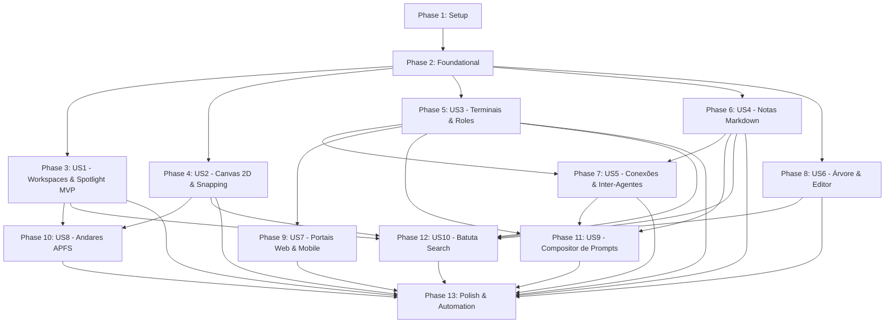

# Tasks: Documentação Completa e Especificação Funcional da Plataforma Maestri

**Input**: Design documents from `/specs/011-maestri-complete-docs/`
**Prerequisites**: plan.md, spec.md, research.md, data-model.md, contracts/ui-contracts.md, quickstart.md

---

## Phase 1: Setup (Infraestrutura Compartilhada)

**Purpose**: Verificação das estruturas base, arquivos de entrada e preparação do ambiente

- [X] T001 Validar a integridade de sintaxe e inicialização dos módulos do backend em `electron/main.js` e `electron/terminal-manager.js`
- [X] T002 [P] Validar a integridade de sintaxe e dependências do renderer em `public/js/main.js` e `public/styles.css`
- [X] T003 [P] Assegurar a presença do schema base de persistência do `state.json` em `electron/state-migrate.js`

---

## Phase 2: Foundational (Pré-requisitos Bloqueantes)

**Purpose**: Estruturas de dados no backend que suportam a plataforma completa

**⚠️ CRITICAL**: A persistência e os canais IPC do Electron são necessários para todas as histórias de usuário

- [X] T004 Estender o modelo do `state.json` em `electron/terminal-manager.js` para registrar andares (`floors`), grupos (`groups`), abraçadeiras (`cableTies`), roles e rascunhos de prompts
- [X] T005 [P] Registrar canais IPC centrais para ciclo de vida de nós, andares e rascunhos em `electron/main.js`
- [X] T006 [P] Atualizar a ponte IPC e listeners de eventos no renderer em `public/js/main.js`

**Checkpoint**: Backend e ponte IPC preparados para todas as operações da plataforma.

---

## Phase 3: User Story 1 - Gestão Completa de Workspaces, Mini Barra Lateral e Spotlight (Priority: P1) 🎯 MVP

**Goal**: Workspaces isolados com execução contínua em segundo plano, mini barra lateral interativa (hover, long-press, clique direito), sincronização `CLAUDE.md` ↔ `AGENTS.md`, botão de abertura no editor e indexação nativa no Spotlight do macOS com deep-links `maestri://open`.

**Independent Test**: Criar workspaces com diretórios distintos; alternar na mini barra lateral; verificar execução contínua em segundo plano; testar sync entre `CLAUDE.md` e `AGENTS.md`; clicar no botão "Abrir no Editor"; buscar notas e terminais no Spotlight do macOS e verificar foco direto no nó.

### Implementation for User Story 1

- [X] T007 [US1] Implementar execução contínua de processos PTY em segundo plano ao alternar de workspace em `electron/terminal-manager.js`
- [X] T008 [P] [US1] Implementar sincronização automática bidirecional entre `CLAUDE.md` e `AGENTS.md` com debounce anti-loop em `electron/main.js`
- [X] T009 [P] [US1] Finalizar o modo mini da barra lateral com hover de rótulo (>200ms) e long-press (~400ms) abrindo popover de terminais em `public/js/workspace-sidebar.js`
- [X] T010 [US1] Vincular botão de abertura no editor de código no cabeçalho superior direito em `public/js/main.js`
- [X] T011 [P] [US1] Implementar gerador de metadados indexáveis para macOS Spotlight e handler de protocolo `maestri://open` em `electron/spotlight-service.js` e `electron/main.js`
- [X] T012 [US1] Implementar navegação entre workspaces via teclado (`Ctrl + ↑/↓`), atalhos numéricos temporários (`Ctrl` duplo) e rolagem com `Ctrl` em `public/js/workspace-sidebar.js`

**Checkpoint**: User Story 1 (MVP) 100% funcional com navegação rápida de workspaces e integração de sistema.

---

## Phase 4: User Story 2 - Canvas Espacial 2D, Snapping Magnético, Elevação e Grupos (Priority: P1)

**Goal**: Área de trabalho 2D infinita sobre grade de 20pt, encaixe magnético de tiles ao segurar `Ctrl`, elevação com duplo clique no cabeçalho, acoplamento em coluna lateral fixa, agrupamento com frame compartilhado (`Ctrl+G`) e organização em grid (`Ctrl+Shift+T`).

**Independent Test**: Navegar no canvas por pan e zoom; arrastar nós segurando `Ctrl` para validar o alinhamento magnético; dar duplo clique no cabeçalho de um nó para elevá-lo e arrastar para a borda para acoplar em coluna; criar um grupo com `Ctrl+G` e mover em conjunto pelo cabeçalho; teclar `Ctrl+Shift+T` para organizar nós em grade.

### Implementation for User Story 2

- [X] T013 [US2] Implementar algoritmo de *Magnetic Tile Snapping* (alinhamento de paredes e preenchimento de vazios com tecla `Ctrl`) em `public/js/canvas.js`
- [X] T014 [P] [US2] Implementar elevação de nó (duplo clique para foco centralizado sobreposto) e acoplamento em coluna lateral fixa (docked column) em `public/js/canvas.js` e `public/styles.css`
- [X] T015 [US2] Implementar criação, renderização e movimentação em bloco de `GroupFrame` (`Ctrl+G` e `Ctrl+Shift+G`) com auto-dissolução para < 2 membros em `public/js/canvas.js` e `public/styles.css`
- [X] T016 [P] [US2] Implementar alinhamento espacial (esquerda, centro, direita, topo, meio, fundo, distribuição H/V) e arranjo automático em grade (`Ctrl+Shift+T`) em `public/js/canvas.js`

**Checkpoint**: Canvas 2D ergonomicamente avançado com manipulação espacial e agrupamentos.

---

## Phase 5: User Story 3 - Terminais Inteligentes, Responsabilidades Portáteis (Roles) e Sistema de Atenção (Priority: P1)

**Goal**: Terminais interativos com sidecars portáteis `role.json` para agentes (Líder, Dev, Revisor, Tester) com auto-descoberta no repositório, temas de cores iTerm2 e Ghostty (`~/.maestri/terminal/themes/`), ponto vermelho de atenção passivo (`Ctrl+Shift+A`), notificações do SO e atalhos numéricos (`Ctrl + 1..9`).

**Independent Test**: Criar um terminal com responsabilidade e verificar geração do `role.json`; clicar em "Descobrir Responsabilidades" para importar roles do projeto; aplicar temas iTerm2 e customizados do Ghostty; verificar ponto vermelho de atenção quando a saída do terminal cessa e navegar com `Ctrl+Shift+A`; teclar `Ctrl+1..9` para foco direto.

### Implementation for User Story 3

- [X] T017 [US3] Implementar gerenciamento e injeção de sidecars portáteis `role.json` nos subdiretórios de terminais em `electron/roles.js` e `public/js/terminal.js`
- [X] T018 [P] [US3] Implementar funcionalidade "Descobrir Responsabilidades" com varredura recursiva de arquivos `role.json` em `electron/roles.js` e modal de importação em `public/js/terminal.js`
- [X] T019 [P] [US3] Implementar seletor com mais de 30 esquemas de cores iTerm2 e leitor de temas Ghostty em `~/.maestri/terminal/themes/` com modo "Seguir sistema" em `public/js/settings.js`
- [X] T020 [US3] Implementar detecção de inatividade de saída, ponto vermelho de atenção no cabeçalho, atalho cíclico `Ctrl+Shift+A` e notificações do SO em `public/js/terminal.js` e `electron/main.js`
- [X] T021 [US3] Implementar badges numéricos temporários no cabeçalho ao segurar `Ctrl` e foco imediato com as teclas `1..9` em `public/js/terminal.js`

**Checkpoint**: Orquestração multi-terminal com papéis portáteis e supervisão ergonômica.

---

## Phase 6: User Story 4 - Notas Markdown Vivas, Imagens Inline e Encadeamento (Priority: P1)

**Goal**: Notas como arquivos markdown reais no disco com modos Raw e Formatada, colagem de imagens (`⌘V`), renomeação dinâmica com fallback para a 1ª linha, encadeamento em árvore para leitura por agentes e suporte a arquivos externos do Finder.

**Independent Test**: Criar nota, colar imagem da área de transferência e validar renderização imediata; renomear manualmente e esvaziar para testar auto-derivação pela 1ª linha; conectar notas em cadeia e validar leitura de toda a hierarquia pelo CLI; arrastar `.md` do Finder para o canvas.

### Implementation for User Story 4

- [X] T022 [US4] Implementar alternância entre modos Raw e Formatada com renderização de markdown e salvamento de assets colados (`⌘V`) em `public/js/notes.js` e `electron/main.js`
- [X] T023 [P] [US4] Implementar renomeação customizada com duplo clique no cabeçalho e restauração automática dinâmica baseada na primeira linha em `public/js/notes.js`
- [X] T024 [P] [US4] Implementar ação "Mover para..." para salvar nota em diretório de projeto sem remoção do arquivo ao excluir o nó em `public/js/notes.js` e `electron/main.js`
- [X] T025 [US4] Implementar suporte ao comando CLI `maestri note read --chain` com travessia recursiva do grafo de notas conectadas em `electron/agent-cli.js` e `public/js/notes.js`
- [X] T026 [US4] Permitir arrastar e soltar arquivos `.md`, `.markdown` e `.txt` do Finder diretamente para o canvas em `public/js/canvas.js`

**Checkpoint**: Notas ricas integradas ao sistema de arquivos e acessíveis por agentes.

---

## Phase 7: User Story 5 - Conexões com Física de Cordas ou Trilhos de Circuito e Orquestração Inter-Agentes (Priority: P1)

**Goal**: Conexões nos estilos Corda (física elástica) e Circuito (trilhos ortogonais alinhados aos eixos com curvas de 90°), abraçadeiras visuais (`Alt + traço`), skill de CLI com roteamento inter-agentes automático quando o receptor estiver desselecionado e popover de inspeção.

**Independent Test**: Ligar nós com conexões e alternar entre Corda e Circuito; criar abraçadeiras segurando `Alt` e desenhando sobre as cordas; instruir um agente a enviar mensagem para outro terminal e verificar entrega de resposta automática enquanto o receptor estiver desselecionado; abrir popover de conexões e clicar para navegar até o nó remoto.

### Implementation for User Story 5

- [X] T027 [US5] Implementar estilos de conexão "Corda" (com física cúbica de gravidade) e "Circuito" (trilhos ortogonais com curvas de 90°) configuráveis por conexão em `public/js/connections.js`
- [X] T028 [P] [US5] Implementar criação de abraçadeiras visuais (`Alt + traço` cruzando cabos), movimentação do feixe ao longo dos cabos e remoção com Delete em `public/js/connections.js`
- [X] T029 [US5] Implementar skill de CLI `maestri send` nos terminais com despacho de mensagens e roteamento da resposta quando o terminal receptor estiver desselecionado em `electron/agent-cli.js`, `electron/terminal-manager.js` e `public/js/connections.js`
- [X] T030 [P] [US5] Implementar popover de inspeção de conexões no nó com navegação de câmera até o nó conectado (mesmo em outros andares) e botão `×` para desconectar em `public/js/connections.js`

**Checkpoint**: Colaboração inter-agentes autônoma com cabos físicos e organização de layout.

---

## Phase 8: User Story 6 - Árvore de Arquivos Multivisualização e Editor de Código Embutido (Priority: P2)

**Goal**: Nó de Árvore de Arquivos com 4 modos (Lista, Grade de Ícones com Quick Look, Diff de alterações e Grafo Git de commits), editor de código integrado (CodeMirror) com sintaxe e múltiplos cursores, busca de arquivos (`Ctrl+P`), busca interna (`>`) e citação de código para agentes via chat.

**Independent Test**: Inserir árvore de arquivos e alternar os 4 modos; abrir arquivo no editor embutido, alterar com realce e salvar; selecionar trecho e enviar citação para agente conectado; teclar `Ctrl+P` no nó para busca fuzzy de arquivos e digitar `>termo` para buscar dentro dos arquivos.

### Implementation for User Story 6

- [X] T031 [US6] Implementar as 4 visualizações do nó da árvore (Lista hierárquica, Grade de Ícones com miniaturas Quick Look, Diff lado a lado e Grafo Git) em `public/js/filetree.js` e `electron/filetree-service.js`
- [X] T032 [P] [US6] Integrar editor de código nativo (CodeMirror) com realce de sintaxe, múltiplos cursores, busca/substituição e auto-fechamento no nó da árvore em `public/js/filetree.js`
- [X] T033 [US6] Implementar botão de chat flutuante em seleções de código no editor ou Diff para citar trechos diretamente a terminais de agentes conectados em `public/js/filetree.js`
- [X] T034 [P] [US6] Implementar atalho `Ctrl+P` no nó para busca fuzzy de arquivos e busca de conteúdo prefixada com `>` com salto direto para a linha do arquivo em `public/js/filetree.js` e `electron/filetree-service.js`

**Checkpoint**: Gerenciador e editor de arquivos embutidos no canvas com integração direta com IAs.

---

## Phase 9: User Story 7 - Portais Web e Dispositivos Móveis com Controle Manual e Automação de IA (Priority: P2)

**Goal**: Portais Web (WebKit isolado com compartilhamento de cookies entre portais) e Portais de Dispositivos Móveis (Simulador iOS e Emulador Android) com renderização acelerada por GPU, controles manuais de toque/botões e automação por agentes via árvore de acessibilidade nativa.

**Independent Test**: Criar portal web e navegar; conectar dois portais e validar compartilhamento de sessão; abrir portal de dispositivo móvel e interagir com toques e botões físicos virtuais; executar automação por agente lendo árvore de acessibilidade nativa com coordenadas exatas.

### Implementation for User Story 7

- [X] T035 [US7] Implementar Portais Web baseados em WebKit com instâncias particionadas e compartilhamento de cookies/sessão ao conectar portais entre si em `public/js/portals.js` e `electron/main.js`
- [X] T036 [P] [US7] Implementar automação de portais web para agentes via CLI `maestri portal` (clicar, digitar, rolar, navegar, screenshots, eval JS, DOM) em `electron/agent-cli.js` e `public/js/portals.js`
- [X] T037 [US7] Implementar módulo de gerenciamento de dispositivos móveis (Simuladores iOS via `xcrun simctl` e Emuladores Android via `adb`) com streaming de tela acelerado por GPU em `electron/device-manager.js` e `public/js/portals.js`
- [X] T038 [P] [US7] Implementar controle manual tátil (toques, deslizar, rotação retrato/paisagem) e botões físicos (Home, Lock, Back, Recents) para dispositivos móveis em `public/js/portals.js`
- [X] T039 [US7] Expor árvore hierárquica de acessibilidade nativa de apps móveis para agentes via CLI `maestri device tree` em `electron/device-manager.js` e `electron/agent-cli.js`

**Checkpoint**: Portais web e móveis com automação visual e acessibilidade de ponta a ponta.

---

## Phase 10: User Story 8 - Andares (Floors) com Clonagem APFS Copy-on-Write, Aterrissagem e Hooks (Priority: P2)

**Goal**: Ambientes de branch isolados com clonagem instantânea copy-on-write APFS em `.maestri/floors/`, transição 3D do canvas, opção de clonar layout do Térreo, hooks de ciclo de vida (Setup, Run, Teardown) com variáveis de ambiente e interface de aterrissagem (merge) com diff e detecção de conflitos.

**Independent Test**: Criar novo andar e verificar clonagem instantânea em `.maestri/floors/`; transitar em 3D entre andares; rodar hooks de Setup e Run; aterrissar commits no Térreo com prévia de diff e merge limpo.

### Implementation for User Story 8

- [X] T040 [US8] Implementar criação de andares com clonagem instantânea copy-on-write APFS no macOS (e worktrees git no Windows) em `electron/main.js` e `public/js/floors.js`
- [X] T041 [P] [US8] Implementar transição de perspectiva espacial 3D para visualização e troca de andares em `public/js/canvas.js` e `public/js/floors.js`
- [X] T042 [US8] Implementar opção "Clonar layout do Térreo" duplicando posições relativas de notas, terminais e blocos de texto no novo andar em `public/js/floors.js`
- [X] T043 [P] [US8] Implementar gerenciador e executor de hooks de ciclo de vida (Setup, Run, Teardown) com variáveis de ambiente (`$MAESTRI_FLOOR_NAME`, etc.) e ícone ⚡ em `electron/main.js` e `public/js/floors.js`
- [X] T044 [US8] Implementar interface de aterrissagem (merge) com gráfico de transferência de commits, prévia de diff e detecção de conflitos em `public/js/floors.js` e `electron/main.js`

**Checkpoint**: Ambientes paralelos de branches com clonagem instantânea e ciclo de vida completo.

---

## Phase 11: User Story 9 - Compositor de Prompts Rico Flutuante, Menções (@) e Rascunhos Persistentes (Priority: P2)

**Goal**: Compositor de prompts rico flutuante ancorado ao terminal ativo (`Ctrl+Shift+P`), menções estruturadas via `@` (terminais, notas vivas, portais, arquivos, `@Maestro`), envio de imagens em pixels nativos / SSH, rascunhos persistentes por terminal e passthrough de teclado no vazio.

**Independent Test**: Focar em um terminal e teclar `Ctrl+Shift+P`; digitar `@` e selecionar nó ou arquivo; colar imagem e validar exibição de chip com entrega em pixels; alternar de andar e verificar integridade do rascunho; validar passthrough de setas/Enter quando o composer estiver vazio.

### Implementation for User Story 9

- [X] T045 [US9] Implementar container flutuante do Compositor de Prompts ancorado ao terminal com foco ativo (`Ctrl+Shift+P`) em `public/js/prompt-composer.js` e `public/styles.css`
- [X] T046 [P] [US9] Implementar menu de autocompletar de menções `@` (terminais conectados, notas vivas, portais, busca de arquivos, `@Maestro` e ações) em `public/js/prompt-composer.js`
- [X] T047 [P] [US9] Implementar chips de mídia com miniaturas inline de imagens (com envio de pixels nativos ao CLI / SSH) e chips de arquivos do projeto em `public/js/prompt-composer.js` e `electron/main.js`
- [X] T048 [US9] Implementar persistência de rascunhos de prompts isolados por terminal com retenção entre trocas de andares e workspaces em `public/js/prompt-composer.js` e `electron/terminal-manager.js`
- [X] T049 [US9] Implementar passthrough transparente de teclado (Setas, Return, Tab) para o terminal subjacente quando o compositor estiver vazio em `public/js/prompt-composer.js`

**Checkpoint**: Composição de prompts contextuais com menções ricas e rascunhos à prova de perda.

---

## Phase 12: User Story 10 - Batuta Search (Paleta de Comandos Global), Busca Global e Ações Rápidas (Priority: P3)

**Goal**: Paleta unificada (`Ctrl+P`) com busca fuzzy ignorando acentos e caixa alta/baixa em todos os workspaces, andares, nós e textos de notas, navegação instantânea de câmera, catálogo de ações e fluxos "Pedir..." e "Verificar...".

**Independent Test**: Teclar `Ctrl+P` em qualquer ponto do canvas; buscar termo acentuado digitando sem acento; selecionar resultado e verificar deslocamento de câmera com foco; executar ação "Pedir..." enviando mensagem multilinha com prévia ao vivo; acionar "Verificar..." para stream somente leitura.

### Implementation for User Story 10

- [X] T050 [US10] Implementar motor de busca fuzzy unificado (insensível a caixa/acentos com destaque de caracteres combinados em negrito) indexando todos os nós, workspaces e andares em `public/js/batuta-search.js`
- [X] T051 [P] [US10] Implementar salto e navegação espacial com translação suave de câmera, troca de workspace/andar e foco de digitação ao selecionar resultado em `public/js/batuta-search.js` e `public/js/canvas.js`
- [X] T052 [US10] Implementar catálogo de ações globais e contextuais dinâmicas baseadas no nó selecionado quando o campo de busca estiver vazio em `public/js/batuta-search.js`
- [X] T053 [P] [US10] Implementar fluxo "Pedir..." (envio de prompt multilinha com prévia da resposta ao vivo e atalho `Ctrl+Enter`) e fluxo "Verificar..." (stream somente leitura) em `public/js/batuta-search.js`

**Checkpoint**: Navegação global e execução de comandos exclusivamente pelo teclado.

---

## Phase 13: Polish & Cross-Cutting Concerns

**Purpose**: Testes automatizados, verificação de regressão e garantia de qualidade

- [X] T054 [P] Criar suite de testes automatizados headless com Electron cobrindo todos os módulos em `scratch/test-maestri-full-parity.cjs`
- [X] T055 Executar verificação de sintaxe `node -c` em todos os arquivos de backend e frontend
- [X] T056 Executar validação final dos fluxos descritos em `specs/011-maestri-complete-docs/quickstart.md`

---

## Dependencies & Execution Order

### Parallel Execution Opportunities
- **US1, US2, US3, US4, US6**: Podem avançar em paralelo após a Fase 2 (arquivos e responsabilidades desacopladas).
- **US5 (Conexões)**: Desenvolvida sobre a base de terminais (US3) e notas (US4).
- **US7 (Portais)**: Desenvolvida sobre a base de terminais (US3).
- **US8 (Andares)**: Desenvolvida sobre a base de workspaces (US1) e canvas (US2).
- **US9 (Compositor)**: Depende de terminais (US3), notas (US4) e conexões (US5).
- **US10 (Batuta Search)**: Indexa as entidades criadas nas US1, US2, US3, US4 e US6.

---

## Implementation Strategy (MVP First)

1. **MVP (Phase 3 - US1)**: Gestão de Workspaces, Mini Barra Lateral, Background loop, Sincronização `CLAUDE.md` ↔ `AGENTS.md`, botão de editor e Spotlight.
2. **Incremento Espacial (Phase 4 - US2)**: Snapping magnético, elevação, acoplamento e grupos.
3. **Incremento de Agentes e Notas (Phase 5, 6 & 7 - US3, US4 & US5)**: Roles portáteis, notas ricas e conexões inter-agentes autônomas.
4. **Incremento de Inspeção e Plataforma (Phase 8 & 9 - US6 & US7)**: Árvore de arquivos com editor embutido e portais web/dispositivos.
5. **Incremento Avançado (Phase 10, 11 & 12 - US8, US9 & US10)**: Andares APFS, Compositor de prompts rico e Batuta Search global.
6. **Validação Final (Phase 13)**: Testes automatizados headless com Electron.
